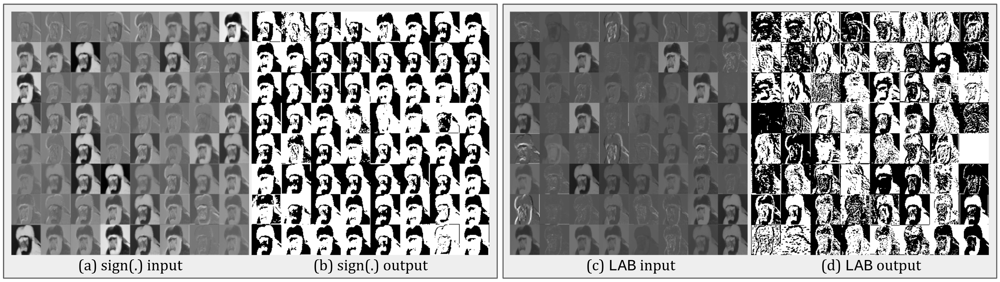
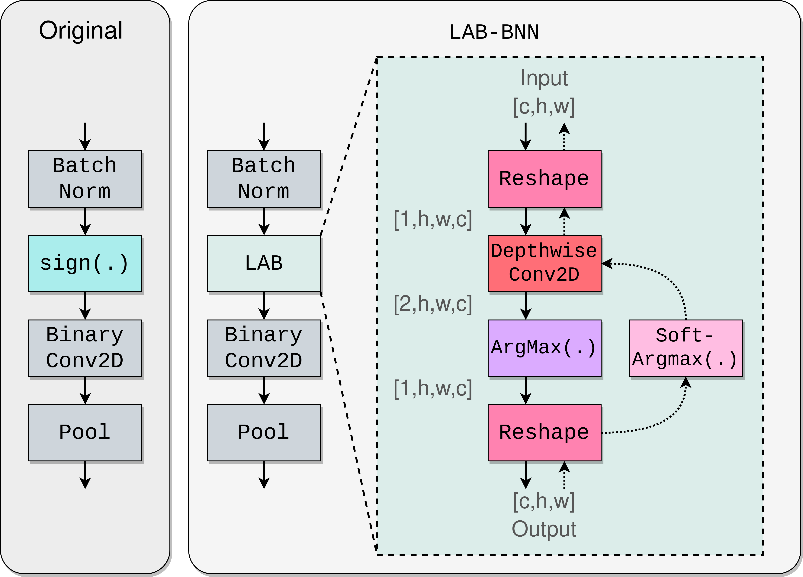

# LAB
#### This paper is accepted to appear in the proceedings of WACV 2023
### This is the official repository for [LAB: Learnable Activation Binarizer for Binary Neural Networks](https://arxiv.org/abs/2210.13858) (Sieger Falkena, Hadi Jamali-Rad, Jan van Gemert)

# Abstract
Binary Neural Networks (BNNs) are receiving an upsurge of attention for bringing power-hungry deep learning towards edge devices. The traditional wisdom in this space is to employ Sign(.) for binarizing feature maps. We argue and illustrate that Sign(.) is a \emph{uniqueness bottleneck}, limiting information propagation throughout the network. To alleviate this, we propose to dispense Sign(.), replacing it with a learnable activation binarizer (LAB), allowing the network to learn a fine-grained binarization kernel per layer - as opposed to global thresholding. LAB is a novel universal module that can seamlessly be integrated into existing architectures. To confirm this, we plug it into four seminal BNNs and show a considerable accuracy boost at the cost of tolerable increase in delay and complexity. Finally, we build an end-to-end BNN (coined as \ournetwork) around LAB, and demonstrate that it achieves competitive performance on par with the state-of-the-art on ImageNet

# Pre- and post-binarization of sign vs LAB
<p align="center">

</p>

# LAB architecture:
<p align="center">

</p>

# Results of applying LAB to 4 different architectures:

| Network   | Backbone   | Epochs | Method | Top 1 [%] | Top 5 [%] | Model size [MB] | latency [ms] |
|-----------|------------|--------|--------|-----------|-----------|-----------------|--------------|
| XNOR-Net  | AlexNet    | 60     | Sign   | 44.0      | 68.1      | 23.9            | 50.8         |
|           |            |        | LAB    | 46.5      | 70.3      | 24.4            | 55.1         |
| BiRealNet | ResNet-18  | 150    | Sign   | 54.4      | 77.6      | 4.18            | 72.5         |
|           |            |        | LAB    | 59.1      | 81.2      | 4.65            | 100.6        |
| QuickNet  | ResNet-18  | 120    | Sign   | 58.7      | 81.2      | 4.35            | 58.1         |
|           |            |        | LAB    | 62.5      | 84.0      | 4.85            | 82.4         |
| ReActNet  | MobieNetV1 | 75     | Sign   | 62.4      | 83.4      | 7.74            | 108.1        |
|           |            |        | LAB    | 64.1      | 84.8      | 8.69            | 210.9        |

# Structure of repository
LAB is built on top of the repositories of [Larq](https://github.com/larq). Therefore this repository contains submodules of forks of Larq repositories. Files that are different with respect to the Larq repositories:
* `larq/larq/quantizers.py` This is where LAB has been implemented.
* `zoo/larq_zoo/literature/lab_bnn.py` This is where LAB-BNN has been implemented.
* `zookeeper/zookeeper/tf/experiment.py` Added functionality to switch LAB on or off in resnet blocks, as well as an option to provide an experiment name
* `visualization` Folder with tools for generating the operation profiling in figures 6: `show_op_profile.py`, and for generating an interactive plot or table 8: `show_scatterplot.py`.


# Data:
We use the datasets Imagenette and ImageNet:
1. Imagenette: [https://github.com/fastai/imagenette](https://github.com/fastai/imagenette)
2. ImageNet: [https://www.image-net.org/](https://www.image-net.org/)

If you already have these datasets downloaded, please refer to `zoo/larq_zoo/training/datasets.py` for changing the paths to your datasets. Furthermore, the default download directory can be specified in `zookeeper/zookeeper/tf/dataset.py` as well as options for caching the datasets.

# Getting started:
Clone the repository with its submodules:

`git clone --recurse-submodules -j8 git@github.com:sfalkena/LAB.git`

Install dependencies by instantiating an virtual environment (tested with python 3.6.9) and then:
``` 
./install_requirements.sh
```

Example training BirealNet with LAB blocks enabled:

`lqz TrainBiRealNet dataset=Imagenette use_progress_bar=True experiment_name=brn_with_lab_blocks lab_blocks=True,True,True,True batch_size=32` 

Example training LabBNN:

`lqz TrainLabBNN dataset=Imagenette use_progress_bar=True experiment_name=lab_bnn lab_blocks=True,True,True,True batch_size=32` 
# Inference on the edge
In order to generate a model optimized for inference on the edge, we need Larq compute engine: `pip install larq-compute-engine`
An example file to generate a tflite model is given in `compute-engine/examples/converter_examples.py`. This can be executed on the host machine.
The resulting tflite model can than be transferred to the edge device (we used an Nvidia Jetson Xavier NX), together with the bechnmark tool which can be downloaded from [https://github.com/larq/compute-engine/releases](https://github.com/larq/compute-engine/releases).
This benchmark tool is based on the [tflite benchmark](https://www.tensorflow.org/lite/performance/measurement) tool and so all functionalities are available. Interesting flags that have been used for our paper are: `--enable_op_profiling`, `--num_threads`, `--num_runs`.


# Visualization of results:
``` 
pip install pandas
pip install altair
```

After having used the `--enable_op_profiling` option, a folder of csv's can be saved that can be loaded in `visualization/show_op_profile.py`. The result of running the script will be a html file with an interactive chart.

Furthermore, `visualization/show_scatterplot.py` holds a script to create an interactive chart to compare various models. The file holds an example for Table 9.
# Contact
Corresponding author: Sieger Falkena (<siegerfalkena@hotmail.com>)

# References
This repository utilizes and builds on top of the [Larq](https://github.com/larq) framework.

# Citation

```(bibtex)
@article{falkena2022lab,
  title={LAB: Learnable Activation Binarizer for Binary Neural Networks},
  author={Falkena, Sieger and Jamali-Rad, Hadi and van Gemert, Jan},
  journal={arXiv preprint arXiv:2210.13858},
  year={2022}
}
```
